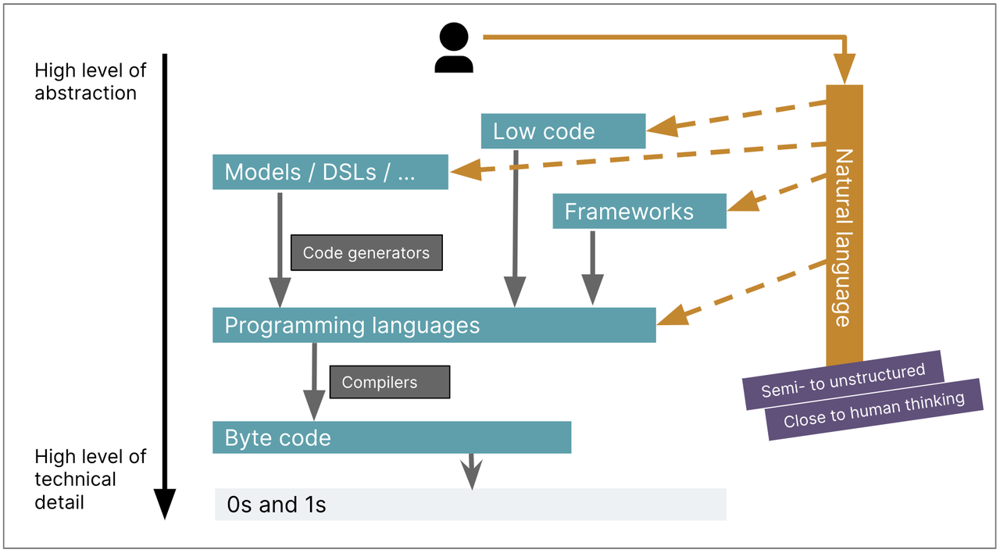

# 软件工程AI应用的现状及展望 副本

在5月末的MPD AI驱动创新峰会中，AI工程应用相关的各个分享团队频繁提及了几个概念：**“Spec”，“Harness”，“AI\-Native”，“Human in the loop”，“Shift\-left（左移）”，“Non\-determinism（非确定性）”**。且多个团队都遇到一个问题：“**当前，AI Coding已大范围应用，开发人员的Token消耗非常高，但是组织的整体效率似乎没有质的飞跃？**” 在会议上，各个团队分享了他们对于这个问题的看法以及探索。**以下将结合大会内容和业界的一些主流观点，谈一谈对上述概念、问题的看法。主要谈论3个问题：**

1. 当前AI Coding的核心问题是什么？

2. 为什么AI Coding没有让组织的整体效率出现质的飞跃？


3. 在AI时代，可以从哪些方向上提升组织效率？

以下内容并不包含具体的、可执行的指导方案，而是对行业宏观趋势的观察和思考，主要是一些较为抽象的“方向”上的总结（目前，AI编程范式也仍在探索阶段，大会上各个团队提出的方案也不相同，没有成熟的、适用所有团队的指导方案）。但进行这些方向上的讨论也是有价值的，希望大家可以通过本次分享有以下收获：

- 对当前AI Coding遇到的一些问题有更本质的认识；

- 理解当前流行的AI编程范式的核心是什么，为什么会出现这些AI编程范式，应该重点关注哪些方面；

- 主动去思考未来成熟的AI编程范式应该是什么样的，提出适合当前团队的AI编程范式。

## 当前AI Coding的核心问题之一：非确定性

MPD会议上，多个团队频繁提到一个词汇：**Non\-determinism（非确定性）。** 去年6月，Vibe Coding爆火时，Martin Flower就呼吁大家关注**Non\-determinism（非确定性），**并提出了一个观点：

当前AI变革的核心在于**从确定性到非确定性**的转变，这有可能彻底改变软件工程师的思维方式和工作环境。未来，软件工程的重点可能转变为**系统地管理非确定性。**

\-\- Martin Flower，2025\.06

### 1\.1 Non\-determinism（非确定性）是什么？

回顾整个软件工程的整个发展历史，我们可以发现其核心就是在和复杂度做斗争。编程语言的发展亦是，我们一直在**追求更高层次的抽象**，以提升生产力。其实核心就是：降低复杂度，让一切变得简单。 

- **汇编语言 vs\. 机器指令：** 汇编让我们用助记符替代了 0 和 1，但仍需关注特定机器的寄存器和指令集。

- **高级语言 \(HLLs\) vs\. 汇编：** Fortran、COBOL 等早期 HLLs，包括后期出现的C语言， 让我们能用语句、条件、循环来思考，而不用关心数据如何在寄存器间移动。

- **代语言、框架、DSL vs\. 早期 HLLs：** Ruby、Go、Python 等现代语言，以及各种框架和领域特定语言（DSL），进一步提升了抽象层次。我们现在可以本能地将函数作为数据传递，使用丰富的库和模式，而不用从头编写大量底层代码。

Martin Fowler 在文章[LLMs bring new nature of abstraction](https://martinfowler.com/articles/2025-nature-abstraction.html)中提到，过去编程语言的发展一直在提升抽象层次和生产力，但它们并没有从根本上改变“编程的性质”。我们仍然是在与机器进行一种“确定性”的对话：**给定相同的输入和代码，我们期望得到相同的输出。错误（Bug）也是可复现的。**然而，LLM 的介入，打破了这一基本假设。

`"We're not just moving `*`up`*` the abstraction levels, we're moving `*`sideways`*` into non-determinism at the same time."  --Martin Fowler`

传统的编程语言、编译器、字节码是一条清晰的、自上而下的抽象路径。模型/DSL、低代码、框架也只是更上一层的抽象，依然输出的是确定的产出。Vibe Coding流行之后，很多人预料中的编程界最高层次的抽象：用自然语言编程，似乎真的来了。但**自然语言（Prompt）**的到来，也给我们带来一些预料之外的东西： 它**不再是简单的往上走，像是一条从旁边切入的、直接通往“半结构化/接近人类思维”的道路，这条路带来了“非确定性”，可能彻底改变软件工程。**

换个更容易理解，更直观的说法：以前写代码，同样的输入永远产生同样的输出。跑一遍是这个结果，再跑一遍还是这个结果。这种确定性是软件复用的基础。但现在用大语言模型，**同样的提示词，给LLM，今天生成的代码和明天生成的可能完全不一样，生产出的软件质量也可能完全不同。**这种不确定性，是软件工程从来没有面对过的。

### 1\.2 从Vibe Coding到Spec、Harness：尝试系统地管理“非确定性”

如今一年过去了，回看Martin Flower的观点，它正确吗？我认为**从当前变化来看，Martin Flower的观点无疑是正确的：虽然LLM变得越来越强，AI Coding的速度越来越快，质量也越来越好，但LLM带来的“非确定性”一直存在。**过去的1年，AI Coding发展迅速，新模型、新工具不断涌现，AI编程范式在短时间内，经历了从Vibe Coding到Spec Coding，再到Harness Engineering的演变。** 这些编程范式、方法论几乎都是在试图建立“确定性”工程体系，尝试系统地管理非确定性：**

- Spec Coding 试图提前“定义”确定性、并“预防”不确定性；

- Harness Engineering 则试图“约束”不确定性。

MPD会议，阿里达摩院团队观点：
**Harness Engineering = ⽤「系统级⼯程」把 LLM 的「不确定」逐层翻译为「确定」**

### 
**1\.3 “非确定性”的本质到底是什么？为什么它一直存在？**

LLM的**“概率预测” \+** 自然语言（Prompt）的**“模糊”   =  ** AI Coding 的 **Non\-determinism（非确定性）**

问题可能出在LLM自身：**目前LLM的核心功能就是“预测”，“预测”的数学内核是“概率”，而“概率”会带来“非确定性”。**从目前的大模型发展来看，LLM“幻觉”几乎是无法避免，因为“幻觉”的本质其实就是LLM的核心功能：预测。只是当预测出我们希望的结果时，我们就称之为“智能”；当预测出我们不希望的结果时，我们就称之为“幻觉”。

上述原因固然合理，但从过去一年AI编程范式的演进来看，还有另一个原因 —— 问题不止在LLM自身，也可能在我们自己身上：**我们撞上了“自然语言编程”的墙。**（以下内容也许可以从不同的角度解释，为什么Vibe Coding之后，逐渐出现了Spec Coding 和 Harness Engineering 等类似的AI编程范式）

### **1\.4 “错误”的道路：自然语言编程**

从Vibe Coding到Spec Coding，再到Harness Engineering，可以发现**这些编程范式、方法论都不是完美的自然语言编程**：我们如果追求低门槛，高速度（Vibe Coding），就得接受低质量、难维护的非生产级产品。如果我们追求高质量的生产级产品， 就需要耗费时间和资源建立完整、可靠的“非确定性”约束工程（Spec、Harness）。

**那我们离高效的、低门槛的、完美的自然语言编程还有多远？**其实对于这个问题，早在48年前，计算机科学的祖师爷之一[Edsger W\. Dijkstra](https://en.wikipedia.org/wiki/Edsger_W._Dijkstra)（艾兹格·迪杰斯特拉，著名的Dijkstra算法的发明者）就给出了他认为了答案：**永远不可能。**我们不应该朝自然语言编程这条路走。Vibe Coding也不可能是生产级软件AI编程范式的最终答案。

#### Dijkstra的预言：我们不可能实现自然语言编程

其实在编程语言刚刚诞生的时代，就已经有不少人觉得编程的各种**“形式化符号”约束**太过严格，他们有一个愿望：希望有一天能用自然语言跟计算机说话。针对这个愿望，1978 年，[Edsger W\. Dijkstra](https://en.wikipedia.org/wiki/Edsger_W._Dijkstra) 写了一篇短文，标题很直接：**《论「****自然语言编程****」的愚蠢》**（[On the foolishness of "natural language programming"](https://www.cs.utexas.edu/~EWD/transcriptions/EWD06xx/EWD667.html)）。Dijkstra 在文章中阐述了他的观点：他认为这个愿望不仅不切实际，而且方向就是错的，我们不可能实现自然语言编程。

然而，48年后的2026年，LLM似乎就快让完美的自然语言编程成为现实了：大量的公司、团队开始推进AI Coding，开发者们的Token消耗不断上升，AI编码采纳率不断提高似乎是不可阻挡的趋势。而且从大家实际工作体验来看，我们平常似乎就是在使用自然语言编程，几乎不再手写代码。

**那么 Dijkstra 错了吗？**虽然现在可能确实出现了一些 Dijkstra 预料之外的情况，但 **Dijkstra 的核心观点并没有错。**[On the foolishness of "natural language programming"](https://www.cs.utexas.edu/~EWD/transcriptions/EWD06xx/EWD667.html) 全文并不长，他主要阐述了3个核心观点：

1. **「形式化符号****」不是负担，而是特权。**很多人只看到了形式化符号的约束，而忽略了它的优点：**有了形式化符号，我们只需满足若干简单、明确的规则，即可准确表达合法的、预期内的实现。**它们在排除各种荒谬、不相关的内容时，非常有效。而我们在使用自然语言时几乎无法避免那些荒谬、不相关的内容。

> **The virtue of formal texts is that their manipulations, in order to be legitimate, need to satisfy only a few simple rules;** they are, when you come to think of it, an amazingly effective tool for ruling out all sorts of nonsense that, when we use our native tongues, are almost impossible to avoid\.
> 
> 形式化文本的优点在于，为了使其操作合法，只需满足几条简单的规则；仔细想来，它们是排除各种荒谬内容的惊人有效的工具，而我们在使用自然语言时几乎无法避免那些荒谬内容。
> 
> 

2. **自然语言中的「自然」本质是一个舒适的“陷阱”。**所谓语言的「自然」，其实是因为它能让我们轻而易举地讲出那些连自己都没意识到的矛盾与荒谬，**它会掩盖逻辑的模糊**。

> When all is said and told, the "naturalness" with which we use our native tongues boils down to the ease with which** we can use them for making statements the nonsense of which is not obvious\.**
> 
> 所谓我们使用自然语言时的“自然性”，归根结底，是我们能够轻易地用自然语言做出那些荒谬性并不明显的陈述。
> 
> 

3. **当我们与机器交互的接口变宽，不一定减轻负担，可能两边都更累。**他指出，接口设计不是简单的劳动分配。让人类与机器的**接口变宽**（例如，让机器根据各种宽泛的自然语言编程），不只是让机器变复杂了，**人类与机器跨接口的沟通成本也会增加**，最终可能双方都更累。他因此**主张「窄接口」（narrow interface）：约束越明确，合作越高效。**

> We know in the meantime that the choice of an interface is not just a division of \(a fixed amount of\) labour, **because the work involved in co\-operating and communicating across the interface has to be added\. **We know in the meantime —from sobering experience, I may add— that a change of interface can easily increase at both sides of the fence the amount of work to be done \(even drastically so\)\. Hence the increased preference for what are now called "narrow interfaces"\. 
> 
> 我们如今已经知道，接口的选择不仅仅是（固定工作量）的划分，因为跨越接口进行协作和交流所涉及的工作量也必须计入。我们如今也已知——我可以补充说，基于令人清醒的经验——接口的改变很容易增加接口两侧的工作量（甚至大幅增加）。因此，人们对现在所谓的“窄接口”越来越偏爱。
> 
> 

#### 我们正集体撞上48年前 Dijkstra 所预言的“墙”

Dijkstra 在文章最后写到：

> From one gut feeling I derive much consolation: I suspect that machines to be programmed in our native tongues —be it Dutch, English, American, French, German, or Swahili— are as damned difficult to make as they would be to use\.
> 
> 一种直觉给了我很大安慰：我猜想，那些需要用母语（无论是荷兰语、英语、美语、法语、德语还是斯瓦希里语）来编程的机器，它们既难以制造，也难以使用。
> 
> 

制造这件事，LLM 似乎做到了。但「难以使用」这个预言，如今也成真了：不是在复杂的操作界面或交互，而是**难在如何让自然语言的模糊性，不变成系统的“非确定性”问题。**

**Vibe Coding 所带来的改变是真实的：**用自然语言描述需求，我们就能在几分钟内实现一个简单的Demo；逐步描述我们想要的功能，LLM可以在1小时内写出过去1天才能实现的代码。我们开始接受「不用想很清楚就可以开始」的工作方式，产品和研发一起摸石头过河。**但在经历了一年左右Vibe Coding的甜蜜期后，我们正集体撞上48年前 Dijkstra 预言的墙，问题开始逐渐显现：**

- **需求幻觉：** 你以为说清楚了，AI 也认为它理解清楚了，但交付的结果似乎总是很容易出错。本质上就是 Dijkstra 说的：自然语言让你轻松说出荒谬性并不明显的话。**你的需求描述有模糊地带，你自己都没意识到，AI 就按它的理解填补了空白。**AI的理解有可能是对的，也有可能是错的，这也是“不确定性”的来源之一。

- **架构缺失：** 自然语言天然缺乏分层、依赖和接口设计的约束。**AI 生成的代码往往“能跑但烂”，**缺乏长期的工程感，很容易被现有代码的风格带偏。

- **上下文降智：**对话一长，AI 的服从性反而变成问题：它会很容易被对话中的某一错误信息反复污染，然后在错误的方向上越走越远，最终放弃或者乱试。这就是 Dijkstra 说的**「接口变宽，两边都更累」**的具体体现。2025年AI编程提示词Top20也能可见一斑：

如今，开发者们终于造出了能听懂自然语言的机器，但发现依然**逃不出Dijkstra的预言： 我们还是需要用形式化来约束它。**

#### 形式化的回归：从 Vibe 到 Spec、Harness

AI编程范式经历了1年多的发展，逐步经历了从Vibe Coding到Spec Coding，再到Harness Engineering的演变。这个过程，其实就是把模糊的自然语言，逐步收窄为 Dijkstra 所推崇的“窄接口”。Spec、验收标准、TDD等**规格和约束，在 AI 时代不再是可选的奢侈品，而是排除 AI “胡说八道”的必需品。自然语言的模糊性不可消解，需要加以形式化约束**，目前业界也是沿着这个趋势发展。从Vibe到现在的Spec、Harness，甚至未来的AI编程范式，我们似乎又要从“自然语言”重新走向“形式化约束”的道路。

形式化仍然是必要的，只是换了形态：Dijkstra 说「形式化符号是排除胡说八道的工具」，但在 AI 时代，这句话变成了：**测试和约束是排除 AI 胡说八道的工具。**

根据上述内容，可以得出一个很有参考价值的观点：

> 写代码变便宜了，但思考没有变便宜。代码越便宜，约束越贵。**驾驭 AI 的能力，本质上是构建形式化约束的能力：把模糊的意图变成精确的规则，把不可验证的期望变成可执行的测试。**
> 
> 

这也是未来一个好的软件工程师应该具备的重要能力。

如今，**AI Coding从编码速度上讲无疑是进步的**，带来的个人效率提升也是真实的。但是**从“信息传递”上讲，AI Coding却是退步的**：

- “**编程的本质是用高度抽象且精确的语言来表述世界。**用AI编程时，我们倒退回模糊的自然语言。当写代码时，我们直接输出的是最终理解；而当我们写提示词时，其本质是**指导AI形成和自己相同的理解，这中间必然会需要更多的信息传导**。这是目前AI编程所无法回避的问题。”（这个也是很多AI Coding问题产生的本质，以及Spec、Harness形式化、工程化回归的原因）

- 反过来讲：“当给定的场景不依赖太多的背景知识，或者是这些背景知识已经被AI正确掌握，又或者需求可以用简单的方式传递时，AI的助力无疑是巨大的。这就是为什么AI领域里前端代码的编写表现最好。（因为中间几乎不涉及业务知识、背景知识等复杂的“信息传递”）”

无论在过去，还是现在的AI时代，**一个合格的程序员始终需要具备一个能力：将模糊的产品业务意图，转化为一个低熵的、机器可理解的、无歧义的形式化描述。**

## 当前，为什么AI Coding没有让组织的整体效率出现质的飞跃？

结合上述内容，以及MPD各个分享团队的观点，**主要包含以下的两个原因：**

### 当前的AI Coding缺乏合理的约束，带来的技术债务，会导致长期效率受损

AI Coding确实大幅提高了编码速度，但也增加了技术债务的累积速度。债务会导致未来的技术返工，可能带来更昂贵的排查、验证、修复、沟通成本。MPD会议上多个团队也反馈，遇到了类似的问题。

> **技术债务（Technical Debt）**是软件工程中的经典概念，指软件开发中为了短期内加速进程、走捷径，而采用次优设计或实现，从而在长期带来维护成本上升、系统复杂度增加等问题。该概念由[沃德·坎宁安](https://baike.baidu.com/item/%E6%B2%83%E5%BE%B7%C2%B7%E5%9D%8E%E5%AE%81%E5%AE%89/6488429?fromModule=lemma_inlink)于1992年提出，将其类比金融债务，指出**低质量代码、设计等，会产生类似利息的累积风险**。
> 
> 这种技术上的选择，**就像一笔****债务****一样，虽然眼前看起来可以得到好处，但必须在未来偿还**，**甚至需要付出额外的成本**。这种“还债”通常涉及重构、调试、问题定位修复和持续的代码维护。
> 
> 虽然技术债务有时是满足业务需求或加快开发的必要权衡，但过度积累会减缓进展、增加成本并降低软件可靠性。**管理技术债务需要平衡短期交付目标与长期代码质量和系统可持续性。**
> 
> 

随着大语言模型的爆发，AI Coding成为主流实践。然而，AI生成的代码具有特殊性：它并非基于工程师的系统性思考，而是基于海量数据统计推断的结果。这导致了新型的技术债务，被称之为**“**[**AI Technical Debt**](https://www.coderio.com/blog/software-development/ai-technical-debt-what-is-why-compounds-how-control/)**”**。其核心痛点在于：AI生成的代码在“表面正确性”的背后，隐藏着深层次的逻辑缺陷、安全漏洞、性能瓶颈和架构腐化，且**这类债务的累积速度远超人工编码。**

**“**[**AI Technical Debt**](https://www.coderio.com/blog/software-development/ai-technical-debt-what-is-why-compounds-how-control/)**”**是指：在依赖AI的系统中，由于工程上的捷径、缺乏治理以及架构上的妥协所累积的成本。

- 与传统技术债务**类似**：它会**减缓未来开发进度并增加维护成本**，导致长期效率受损。

- 与传统技术债务**不同**：它**引入了第二层脆弱性，即概率行为（不确定性）**，而传统的软件工程实践中并未针对此类问题进行系统的管理。

MPD会议上，各团队普遍声称在推广AI Coding后，遇到了类似的技术债务加速累积的**“AI效率悖论”** ：

- AI Coding 的代码质量不稳定，团队代码质量下降很快，导致未来的维护成本上升。

- AI生产代码过快，组织追求快速交付，代码、设计等缺乏人工审查，导致各类问题频发，未来大量的人力消耗在查漏补缺、人工Debug、问题定位修复上。

- \.\.\.\.

### 传统的组织与流程约束了AI的生产效率

**AI产生的技术债务**确实是整体效率未出现飞跃的原因，不过这只是**微观角度的表象原因**。很多团队发现，**即使抛开技术债务不谈，AI对团队整体的提效仍然非常有限。**这是因为AI无法为组织整体效率带来飞跃的**更宏观、更根本的原因是：传统的组织和流程在约束AI的生产效率。**

#### 个人编码提效 ≠ 组织整体提效

过去几个月，AI Coding大范围铺开，相信大家可以感受到，**AI对个人编码的提效是非常明显的**：过去需要8小时的编码任务，如今只需要写prompt，借助AI在1小时内就能完成。**但程序员的主要工作真的是“编码”吗？**

而当前**AI主要还是应用在编码阶段，这就导致对整体工作的提升并不明显**：

- 即使编码效率实打实提速了3倍甚至更多，但编码只占10%  \-\> ** 总提效仅\~20%**

- 编码外的其他工作：产品沟通、需求对齐、联调等待、上线审批、发布验证、问题排查 = **80%时间**

这就**像给马车装了涡轮引擎**：引擎转的再快，速度也不会提升，因为**瓶颈在马车本身**。

#### 信息技术革命、电气革命给我们带来的启发

2026年，AI应用在各行业已大范围铺开，Token消耗量也呈指数级上升，但各个投资机构、公司负责人、老板都在问同一个问题：“**公司投了AI，效率提升了多少？回报在哪？**”。** **同年4月，斯坦福󠄹󠅀󠄪󠄡󠄡󠄢󠄞󠄦󠄤󠄞󠄧󠄢󠄞󠄡󠄨󠄩󠅬󠅅󠅃󠄵󠅂󠄪󠅗󠅥󠅕󠅣󠅤󠅬󠅄󠄹󠄽󠄵󠄪󠄢󠄠󠄢󠄦󠄝󠄠󠄦󠄝󠄢󠄡󠄐󠄡󠄩󠄪󠄤󠄦󠄪󠄢󠄢󠅬󠇘󠅷󠆚󠇕󠆚󠆂󠇔󠆭󠆃󠇗󠆫󠆤󠇕󠆏󠆪󠄐󠄱󠅜󠅜󠄐󠅂󠅙󠅗󠅘󠅤󠅣󠄐󠅂󠅕󠅣󠅕󠅢󠅦󠅕󠅔HAI发布的年度AI指数报告显示，2025年全球AI私人投资超过了5810亿美元，美国独占3440亿以上。**投资在翻倍，回报在缺席**。

> 202󠄹󠅀󠄪󠄡󠄡󠄢󠄞󠄦󠄤󠄞󠄧󠄢󠄞󠄡󠄨󠄩󠅬󠅅󠅃󠄵󠅂󠄪󠅗󠅥󠅕󠅣󠅤󠅬󠅄󠄹󠄽󠄵󠄪󠄢󠄠󠄢󠄦󠄝󠄠󠄦󠄝󠄢󠄡󠄐󠄡󠄩󠄪󠄤󠄦󠄪󠄢󠄢󠅬󠇘󠅷󠆚󠇕󠆚󠆂󠇔󠆭󠆃󠇗󠆫󠆤󠇕󠆏󠆪󠄐󠄱󠅜󠅜󠄐󠅂󠅙󠅗󠅘󠅤󠅣󠄐󠅂󠅕󠅣󠅕󠅢󠅦󠅕󠅔5年，全球企业在生成式AI上花了300到400亿美元。麻省理工学院媒体实验室（MIT Media Lab）发布了一份报告《The GenAI Divide》，该报告追踪了300多个公开AI项目，做了52场高管深度访谈。结论：**95%的企业AI项目没有产生任何可衡量的财务回报。真正从中获益的只有5%。**
> 
> 一项覆盖2444家公司的研究发现，企业每花1美元在AI token上，0\.44美元用来修复AI生成的bug，0\.27美元用来重写AI产出的代码，0\.11美元消耗在审查和合并延迟上。1块钱的采购成本后面，藏着将近80%的隐性损耗。摩根大通发了一份措辞不客气的报告：《AI Token成本正在吞噬互联网利润》。Shopify、S󠄹󠅀󠄪󠄡󠄡󠄢󠄞󠄦󠄤󠄞󠄧󠄢󠄞󠄡󠄨󠄩󠅬󠅅󠅃󠄵󠅂󠄪󠅗󠅥󠅕󠅣󠅤󠅬󠅄󠄹󠄽󠄵󠄪󠄢󠄠󠄢󠄦󠄝󠄠󠄦󠄝󠄢󠄡󠄐󠄡󠄩󠄪󠄤󠄦󠄪󠄢󠄢󠅬󠇘󠅷󠆚󠇕󠆚󠆂󠇔󠆭󠆃󠇗󠆫󠆤󠇕󠆏󠆪󠄐󠄱󠅜󠅜󠄐󠅂󠅙󠅗󠅘󠅤󠅣󠄐󠅂󠅕󠅣󠅕󠅢󠅦󠅕󠅔potify、ServiceNow、Roku在财报电话会上把**AI列为运营支出的主要压力来源。**
> 
> 代码领域的现象更反直觉：**工程师用AI生成代码速度翻倍，但󠄹󠅀󠄪󠄡󠄡󠄢󠄞󠄦󠄤󠄞󠄧󠄢󠄞󠄡󠄨󠄩󠅬󠅅󠅃󠄵󠅂󠄪󠅗󠅥󠅕󠅣󠅤󠅬󠅄󠄹󠄽󠄵󠄪󠄢󠄠󠄢󠄦󠄝󠄠󠄦󠄝󠄢󠄡󠄐󠄡󠄩󠄪󠄤󠄦󠄪󠄢󠄢󠅬󠇘󠅷󠆚󠇕󠆚󠆂󠇔󠆭󠆃󠇗󠆫󠆤󠇕󠆏󠆪󠄐󠄱󠅜󠅜󠄐󠅂󠅙󠅗󠅘󠅤󠅣󠄐󠅂󠅕󠅣󠅕󠅢󠅦󠅕󠅔代码"流失率"，即被抛弃或重写的比例，涨了800%。**
> 
> 沃顿教授Ethan Mollick联合MIT和哈佛对宝洁776名员工做了对󠄹󠅀󠄪󠄡󠄡󠄢󠄞󠄦󠄤󠄞󠄧󠄢󠄞󠄡󠄨󠄩󠅬󠅅󠅃󠄵󠅂󠄪󠅗󠅥󠅕󠅣󠅤󠅬󠅄󠄹󠄽󠄵󠄪󠄢󠄠󠄢󠄦󠄝󠄠󠄦󠄝󠄢󠄡󠄐󠄡󠄩󠄪󠄤󠄦󠄪󠄢󠄢󠅬󠇘󠅷󠆚󠇕󠆚󠆂󠇔󠆭󠆃󠇗󠆫󠆤󠇕󠆏󠆪󠄐󠄱󠅜󠅜󠄐󠅂󠅙󠅗󠅘󠅤󠅣󠄐󠅂󠅕󠅣󠅕󠅢󠅦󠅕󠅔照实验。结果：独自使用AI的个体，绩效等同于两人团队。AI让单人做到了双人产出。但**这根效率的丝线在汇入多人协作的复杂流程时，当场就被冲散。**审批、对齐、󠄹󠅀󠄪󠄡󠄡󠄢󠄞󠄦󠄤󠄞󠄧󠄢󠄞󠄡󠄨󠄩󠅬󠅅󠅃󠄵󠅂󠄪󠅗󠅥󠅕󠅣󠅤󠅬󠅄󠄹󠄽󠄵󠄪󠄢󠄠󠄢󠄦󠄝󠄠󠄦󠄝󠄢󠄡󠄐󠄡󠄩󠄪󠄤󠄦󠄪󠄢󠄢󠅬󠇘󠅷󠆚󠇕󠆚󠆂󠇔󠆭󠆃󠇗󠆫󠆤󠇕󠆏󠆪󠄐󠄱󠅜󠅜󠄐󠅂󠅙󠅗󠅘󠅤󠅣󠄐󠅂󠅕󠅣󠅕󠅢󠅦󠅕󠅔跨部门沟通，每一个环节都是过滤器。**个体的"快"在组织的"慢"里被稀释干净。**
> 
> 

其实类似的事情，在曾经的历史上已经一遍又一遍的上演。1987年，信息技术革命如火如荼，经济学家罗伯特·索洛在《纽约书评》写了一句话，后来被人频繁引用：**"You can see the computer age everywhere but in the productivi󠄹󠅀󠄪󠄡󠄡󠄢󠄞󠄦󠄤󠄞󠄧󠄢󠄞󠄡󠄨󠄩󠅬󠅅󠅃󠄵󠅂󠄪󠅗󠅥󠅕󠅣󠅤󠅬󠅄󠄹󠄽󠄵󠄪󠄢󠄠󠄢󠄦󠄝󠄠󠄦󠄝󠄢󠄡󠄐󠄡󠄩󠄪󠄤󠄦󠄪󠄢󠄢󠅬󠇘󠅷󠆚󠇕󠆚󠆂󠇔󠆭󠆃󠇗󠆫󠆤󠇕󠆏󠆪󠄐󠄱󠅜󠅜󠄐󠅂󠅙󠅗󠅘󠅤󠅣󠄐󠅂󠅕󠅣󠅕󠅢󠅦󠅕󠅔ty statistics\."**（你能在任何地方看到计算机时代，唯独在生产率统󠄹󠅀󠄪󠄡󠄡󠄢󠄞󠄦󠄤󠄞󠄧󠄢󠄞󠄡󠄨󠄩󠅬󠅅󠅃󠄵󠅂󠄪󠅗󠅥󠅕󠅣󠅤󠅬󠅄󠄹󠄽󠄵󠄪󠄢󠄠󠄢󠄦󠄝󠄠󠄦󠄝󠄢󠄡󠄐󠄡󠄩󠄪󠄤󠄦󠄪󠄢󠄢󠅬󠇘󠅷󠆚󠇕󠆚󠆂󠇔󠆭󠆃󠇗󠆫󠆤󠇕󠆏󠆪󠄐󠄱󠅜󠅜󠄐󠅂󠅙󠅗󠅘󠅤󠅣󠄐󠅂󠅕󠅣󠅕󠅢󠅦󠅕󠅔计里看不到）**。**这就是著名的**索洛生产力悖论**。尽管**在20世纪70、80年代，企业在信息技术方面进行了巨额投资，但生产率增长仍然疲软。**信息技术在很大程度上实现了其承诺：可以高效地处理薪资、库存、会计、电子表格等，但这些收益并未在数据中清晰地显现出来。**直到20世纪90年代，生产率增长才真正提速，经济学家将之归因于信息技术的广泛普及与组织变革相结合。**

**同样的事情，在电气时代也上演过一遍。**学术经济学家\-保罗·A·戴维（Paul A\. David）在1990年的经典论文《[The Dynamo and the Computer: An Historical Perspective On the Modern Productivity Paradox](https://www.researchgate.net/publication/4724731_The_Dynamo_and_the_Computer_An_Historical_Perspective_On_the_Modern_Productivity_Paradox)》中写道：发电机早在19世纪末进入工厂，但生产率并未立刻跃升。直到20世纪20年代，电的潜力才真正被释放出来。**中间空了四十年，电去哪了？这么多年，为什么效率没有提升？答案藏在滞后的工厂结构里：**由于蒸汽机技术的限制，蒸汽时代工厂结构的最优解就是通过房梁上一根贯穿全厂的主传动轴，再靠皮带和齿轮，把动力分给每一台机器。这套结构决定了一切。机器必须密密麻麻挤在传动轴周围——因为离得越远，皮带越长，动力损耗越大。

**电气时代，对电力的应用分为三个阶段：**

- **第一阶段：**首先，电来了，工厂主第一反应是什么？当然是**直接把中央的大蒸汽机，换成一台中央的大电动机。**电动机的功率可以达到蒸汽机的十倍，但**生产效率却几乎纹丝不动**。

    - *这就像AI应用初期，各个公司开始在研发部门大范围推进Vibe Coding，让每个程序员都开始AI Coding。*

- **第二阶段：**拆成几台中型电机，分别驱动不同󠄹󠅀󠄪󠄡󠄡󠄢󠄞󠄦󠄤󠄞󠄧󠄢󠄞󠄡󠄨󠄩󠅬󠅅󠅃󠄵󠅂󠄪󠅗󠅥󠅕󠅣󠅤󠅬󠅄󠄹󠄽󠄵󠄪󠄢󠄠󠄢󠄦󠄝󠄠󠄦󠄝󠄢󠄡󠄐󠄡󠄩󠄪󠄤󠄦󠄪󠄢󠄢󠅬󠇘󠅷󠆚󠇕󠆚󠆂󠇔󠆭󠆃󠇗󠆫󠆤󠇕󠆏󠆪󠄐󠄱󠅜󠅜󠄐󠅂󠅙󠅗󠅘󠅤󠅣󠄐󠅂󠅕󠅣󠅕󠅢󠅦󠅕󠅔车间，布局松了些，但底层逻辑没变。这好于第一阶段，但远没到该有的样子。

    - *这就像如今的很多公司开始在每个部门都推进AI应用：产品也开始使用AI写需求文档，进行简单demo开发，客服部搭智能客服，推广多部门通用Agent。但本质还是各自为政、数据不通、流程不打通，还是在现有的各个组织架构里塞个AI。*

- **第三阶段：**开始对整个工厂进行重新设计，每台机器装上自己的小电动机，那根贯穿全厂的主传动轴被扔掉了。机器不再围着动力源转，而是按生产流程排列。这让流水线成为可能。1913年，福特第一个吃透了这套。机器按装配顺序排开，车在传送带上流过每道工序。生产效率，终于在这一刻井喷。福特没使用更强的电机，他只是第一个󠄹󠅀󠄪󠄡󠄡󠄢󠄞󠄦󠄤󠄞󠄧󠄢󠄞󠄡󠄨󠄩󠅬󠅅󠅃󠄵󠅂󠄪󠅗󠅥󠅕󠅣󠅤󠅬󠅄󠄹󠄽󠄵󠄪󠄢󠄠󠄢󠄦󠄝󠄠󠄦󠄝󠄢󠄡󠄐󠄡󠄩󠄪󠄤󠄦󠄪󠄢󠄢󠅬󠇘󠅷󠆚󠇕󠆚󠆂󠇔󠆭󠆃󠇗󠆫󠆤󠇕󠆏󠆪󠄐󠄱󠅜󠅜󠄐󠅂󠅙󠅗󠅘󠅤󠅣󠄐󠅂󠅕󠅣󠅕󠅢󠅦󠅕󠅔开始想这个问题的人：**有了电，工厂应该是什么样子？**

    - *这对应今天终于有人开始思考一个问题：****有了AI，公司组织架构应该是什么样子？这件事本来该怎么干？****例如：如今火热的*[***AI\-Native***](https://www.ibm.com/think/topics/ai-native)*的概念。*

[**AI\-Native**](https://www.ibm.com/think/topics/ai-native)是一种从设计之初就**将AI能力作为核心驱动的系统范式，而非传统AI插件式增强。**

如上所述，电力革命曾经历40年“技术\-生产力”时滞，当前AI技术同样面临类似困境：个体效率提升10倍（如AI编程工具缩短90%开发周期），但组织效率却没有同比提升。核心矛盾在于**技术迭代速度远超组织适配能力**，企业沿用过去的层级架构管理AI生产力，导致技术红利无法释放。

MPD会议，某团队分享在实际项目开发中，**使用AI后编码效率确实可以翻很多倍，但省下的时间迅速被各类沟通和摩擦填满**：

- 人越多 \-\> 组织越复杂 \-\> 内部的沟通成本越高，于是「摩擦」占据的时间，越涨越多。

- 过去公司组织流程基于“人”建立，“人管流程”模式应对AI时代，导致决策链冗长。AI可提升效率，但企业仍保留多层审批，人为制造效率损耗。

从“电力成熟”到“福特流水线”这一跳，用了40年，整整一代人的时间。**那从2023年LLM的成熟，到真正的AI生产效率大爆发需要多久？**目前**单从技术迭代的速度来看，是比较乐观的**，短短几个月内，模型的能力就会出现较大的提升，各类新基础、新概念也层出不穷。**但从另一方面讲，**在电气时代，当时的“悖论”源于利用率不足和缺乏组织变革，而不是技术本身未能兑现其核心承诺。而如今，相比曾经可以提供稳定能源的“电机”，**生成式人工智能（LLM）是否能兑现技术承诺，仍然是一个问号。LLM本身还不是高度可靠的（尽管在某些领域表现已经非常出色，远超人类，但仍然存在非确定性）**，尤其是对于那些需要高精度、高准确率或低容错率的任务。对于关键业务型流程而言，它还未达到可以完全投入实际应用的成熟度。这意味着两件事：

1. 如果它遵循与过去的技术相同的发展路径，我们可能还需要五年甚至更长时间才能看到实质的生产率影响。

2. 单靠技术本身很少能真正推动生产率提升。只有当组织调整其流程，并将技术应用于真正适合的场景时，影响才会显现。

## 在如今的AI时代，如何进一步提升组织效率？

### 预防、约束、管理 “非确定性”，减缓AI技术债务，防止长期效率受损

#### 3\.1\.1 借助AI “对抗” AI，完善自动化审查机制

以AI Coidng为例，在保证代码质量方面，对AI生成的代码进行人工review是应对AI“非确定性”较好的方式。但当前代码生成效率呈指数级增长，人工评审无法匹配AI代码生产的速度和规模。而且Agent已逐渐取得开发者信任，大部分人类工程师也不再逐行查看代码。

**当前的AI时代，传统的人工代码评审存在明显短板:**

1. **效率低下。**AI生成代码极快，评审进度依赖评审人员的时间与精力，容易成为项目迭代的瓶颈;

2. **质量不均。**评审结果受评审人员的技术经验、专注度影响，难以保证评审标准的统一性;

3. **重复劳动。**AI生成的代码质量不稳定，容易出现大量简单的代码规范、格式问题等，这些问题需要评审人员反复指出，浪费人力资源。

因此可以利用AI的优势，建立组织内AI Code Review规范，统一AI评审标准，使用专门的、进行工程优化过的AI CR 工具，为AI Coding的代码质量提供一层看护，减轻人工review负担。

AI审查仅能作为辅助，减轻人工review负担。**由于“非确定性”的存在，核心业务仍需要人类工程师作为不可缺少的质量担保。**

#### 3\.1\.2 借鉴当前流行的AI开发范式：Spec、Harness ，实现对AI交互的“窄接口”，对AI行为进行约束

**Spec Coding、Harness Engineering **这些概念已出现一段时间，但**目前各团队仍在探索阶段，且不同团队的看法也不一致**，存在“各说各话”的情况。

**例如，在MPD会议上，不同团队对Spec有“截然不同”的看法：**

- TocoAI 创始人认为：**Spec 是人和 AI 共建软件的手段。**

    - **Spec应该是动态的**，**需要长期维护。**Spec 持久存在、**随系统演化**，是人和AI 长期共建的基础。在未来，Spec应在一定程度上取代代码，代码变成一种表达方式。类似于[MDD（模型驱动开发）](https://baike.baidu.com/item/%E6%A8%A1%E5%9E%8B%E9%A9%B1%E5%8A%A8%E5%BC%80%E5%8F%91/7000557)。

    - Spec 不是什么：

        - **不是用完即弃的指令。**不是一次性 Prompt，Spec 持久存在、随系统演化，是人和AI 长期共建的基础。

        - **不是需求文档**。需求文档只管 What，Spec 桥接 What 与 How，有约束、有边界、有可验证性

        - **不是任务分解。** 不是 Backlog，不是 TODO 清单。任务分解是执行视角，Spec是设计视角。

- 蚂蚁集团工程师认为：**Spec 是贯穿整个开发周期的稳定锚点。**

    - **Spec应该是静态的，不应长期维护。**Spec 仅在 Design 阶段产出并**冻结，避免维护成本。**

    - Spec 是什么：

        - **是指令，**为了让 AI 清晰理解"做什么"，避免方向偏差。

        - **是单一事实来源**，降低沟通成本。

        - **是冻结的验收标准。**核心理念：流程上不提供修改旧Spec的路径，新需求一律新建文件。Spec成为贯穿整个开发周期的稳定锚点——不是"活文档"，而是冻结的验收标准。

而针对Harness，各个团队更是“五花八门”，有着各自对Harness Engineering不同的理解。**Spec、Harness 目前还没有清晰的定义**，缺乏统一的标准，甚至出现[语义扩散（Semantic Diffusion）](https://martinfowler.com/bliki/SemanticDiffusion.html)的趋势：**缺乏清晰的定义，就难以形成普适的、有效的方法论。**

如上所述，虽然MPD会议上，各个团队对Spec、Harness看法不同，甚至截然相反，但有一个**核心是一致的：都希望通过Spec实现AI时代的“形式化回归”，通过Harness实现对AI的“非确定性”约束，**而不再是仅通过Prompt（纯自然语言）进行编程、开发工作。这也是当前的趋势：各个团队逐渐发现“Vibe Coding”、“纯自然语言编程” 存在局限性，需要对AI编程范式进行修正，需要思考适合自己团队的Spec、Harness。

**Vibe Coding 是低门槛的，Spec、Harness 却未必。**

|维度|自然语言 \- Vibe|Spec、Harness （理想中的）|
|---|---|---|
|含义、 可读性|人人能读，但**充满“模糊”**，**出现歧义难以检测**，问题只在生产事故里现身|追求自然语言一样的可读性，但可以**像程序一样精确，模糊即“编译错误”**|
|细节|**只有模糊的 What**，How 全靠 AI 自由发挥|**What（数据意图）与 How（结构约束）**同时显式表达|
|校验、维护|**机器无法校验**，改一个字段靠人肉追踪影响 范围|**追求“形式化符号”的效果，机器可解析可校验：**改Spec，引擎自动级联同步所有受影响结构。|
|代码一致度|启动时看似准确，一段时间后会出现**一致度“漂移”**，架构意图随迭代逐渐丢失|**Spec与代码的关系永远是=**，不是≈（消除“不确定性”） |
|对研发全链路的本体价值|**无法作为本体**，测试/CI/变更管理 各自维护 一份对系统的**近似理解**|**统一Ontology（本体论），拥有“形式化约束”**：测试断言、代码变更、影响面分析均从同一真相派生|

### AI\-Native：重构传统的组织、流程，解除对AI的束缚

如上一章节所述，大家开始思考一个问题：**有了AI，公司组织架构应该是什么样子？这件事本来该怎么干？**即：[AI\-Native](https://www.ibm.com/think/topics/ai-native)。但解答这个问题仍然是困难的，需要不断的尝试。

电力改变的是物理布局。工厂可以从多层拥挤昏暗变成单层宽敞明󠄹󠅀󠄪󠄡󠄡󠄢󠄞󠄦󠄤󠄞󠄧󠄢󠄞󠄡󠄨󠄩󠅬󠅅󠅃󠄵󠅂󠄪󠅗󠅥󠅕󠅣󠅤󠅬󠅄󠄹󠄽󠄵󠄪󠄢󠄠󠄢󠄦󠄝󠄠󠄦󠄝󠄢󠄡󠄐󠄡󠄩󠄪󠄤󠄦󠄪󠄢󠄢󠅬󠇘󠅷󠆚󠇕󠆚󠆂󠇔󠆭󠆃󠇗󠆫󠆤󠇕󠆏󠆪󠄐󠄱󠅜󠅜󠄐󠅂󠅙󠅗󠅘󠅤󠅣󠄐󠅂󠅕󠅣󠅕󠅢󠅦󠅕󠅔亮，机器可以按流程排列而不是围着传动轴转。这是工程问题，可以画图纸、拆墙、重装机器。**但AI改变的是认知分工。**它意味着重新定义每个岗位：谁思考、谁执行、谁负责。而且没有人见过那个"之后"的样子。所有󠄹󠅀󠄪󠄡󠄡󠄢󠄞󠄦󠄤󠄞󠄧󠄢󠄞󠄡󠄨󠄩󠅬󠅅󠅃󠄵󠅂󠄪󠅗󠅥󠅕󠅣󠅤󠅬󠅄󠄹󠄽󠄵󠄪󠄢󠄠󠄢󠄦󠄝󠄠󠄦󠄝󠄢󠄡󠄐󠄡󠄩󠄪󠄤󠄦󠄪󠄢󠄢󠅬󠇘󠅷󠆚󠇕󠆚󠆂󠇔󠆭󠆃󠇗󠆫󠆤󠇕󠆏󠆪󠄐󠄱󠅜󠅜󠄐󠅂󠅙󠅗󠅘󠅤󠅣󠄐󠅂󠅕󠅣󠅕󠅢󠅦󠅕󠅔的AI模型都在进步，但没有任何一个人能告诉你：你的公司五年后该怎么运转。

工业时󠄹󠅀󠄪󠄡󠄡󠄢󠄞󠄦󠄤󠄞󠄧󠄢󠄞󠄡󠄨󠄩󠅬󠅅󠅃󠄵󠅂󠄪󠅗󠅥󠅕󠅣󠅤󠅬󠅄󠄹󠄽󠄵󠄪󠄢󠄠󠄢󠄦󠄝󠄠󠄦󠄝󠄢󠄡󠄐󠄡󠄩󠄪󠄤󠄦󠄪󠄢󠄢󠅬󠇘󠅷󠆚󠇕󠆚󠆂󠇔󠆭󠆃󠇗󠆫󠆤󠇕󠆏󠆪󠄐󠄱󠅜󠅜󠄐󠅂󠅙󠅗󠅘󠅤󠅣󠄐󠅂󠅕󠅣󠅕󠅢󠅦󠅕󠅔代的组织变革改的是空间，**AI时代的组织变革改的是权责。**前者有人能画图，后者没人见过答案。

而真正AI\-Native应该是什么样子，我们应该如何重构组织和流程？这个问题，大家都开始了自己的思考，提出了各种预想和架构，但目前真正的正确答案是什么，还没有定论。但结合上述内容与各个团队的观点，**以下的几个方向大概率是正确的：**

#### 3\.2\.1 与AI的高效交互需要形式化约束、而非“纯自然语言”

Dijkstra的预言是很有参考价值的，**未来AI\-Native的架构，大概率存在针对AI的“约束层”和“窄接口”**，用来消除模糊、定义确定性。Spec、Harness 当前虽然没有统一的定义，也可能不是最终的答案，但方向是没有问题的。

理想状态下，AI根据标准的需求文档，即可端到端完成开发、测试、修复和交付。但现实是：一句话需求远远不够。**真正驱动AI进行开发的，不是一个模糊的灵感**，而是：

- 清晰的PRD

- 明确的验收标准

- 稳定的技术约束

- 可运行的完整测试

- 清晰、完整的工程上下文

- 。。。

所以，目前AI编程范式，越往后走，**越不像自然语言聊天，而是越来越像一套工程系统。**

#### 3\.2\.2 内化沟通

AI时代，**小团队可能会成为主流**。AI\-Native组织需要减少人与人之间的协作，增加人与 AI 的协作。而这就需要：**内化沟通，将尽量多的子领域放到统一的上下文。**

AI加速个人效率后，人与人之间的协作成本成为了主要的效率损耗，那么一个可选的策略就是**尽可能在一个完整的领域内，减少协作的人数。**当然，这不是说所有公司都应该只有几个人。而是说，基于业务、领域的实际需要，将大团队拆分成多个小团队，减少上下游沟通，减少人与人之间的“拉通”与“对齐”，释放AI的生产力。例如，[阿里巴巴正在推行的OPT](https://mp.weixin.qq.com/s/OJ6-5FquYFPCduffGTzIdg)（one person team，一人团队）

当然，这也是一个很有挑战的组织变动。领域如何合理划分？交付质量如何保证？等等，都是需要考虑的问题。如果变动不合理，OPT（one person team）极有可能变成 OPR（one person risk），而且可能面临大量的交付质量问题。

#### 3\.2\.3 Shift\-Left

[**左移（Shift\-Left）**](https://www.opentext.com/what-is/shift-left)是一种开发方法论，其核心理念是**在项目生命周期中尽早启动质量保证活动**。例如，对于代码开发工作，并非等到编码完成后再进行测试，而是将测试工作引入需求和设计阶段。这种主动式发现问题的方法，可以缩短了反馈回路，确保质量问题可以被尽早发现，尽早处理，从而降低代价高昂的返工风险。左移强调**主动的质量管理**、**早期反馈**和跨团队协作。

与之对应的还有右移（Shift\-Right）的概念，但它与左移并非相互对立的。左移与右移是两种互补的方法，分别关注软件生命周期的不同阶段。右移则侧重于在生产环境或部署后环境中验证软件。通过监控真实环境下的性能、用户行为和安全状况，团队可以检测出在预生产测试中可能无法显现的问题。具体实践包括金丝雀发布、A/B测试、持续监控和混沌工程。

Shift\-Left （左移）并非近些年才出现的概念。早在2001年，Larry Smith 就在他文章《Shift\-Left Testing》中就提出了测试左移的概念和相应的实践。包括敏捷开发中推广的[TDD（Test\-Driven Development）](https://www.ibm.com/cn-zh/think/topics/test-driven-development)也是Shift\-Left的一种具体实践，该类开发方法的核心理念即：“缺陷发现的越早，修复成本就越低”。

Shift\-Left 在过去是“正确但昂贵”的。左移、TDD等概念，虽然已提出多年，但由于其高昂的成本，并未大范围推广开。但在当前的AI时代，这一概念再次引起各个团队的关注。例如：MPD会议上，多个团队在harness工程中引入了TDD。

**Shift\-Left 在AI时代重新引起关注，主要有两个原因：**

- **左移的成本降低：**AI 让曾经贵的事情变得便宜了。

    - 例如，TDD 虽然是“正确”的，但是需要在早期投入较多的资源在业务梳理、测试用例上，这些事情极其消耗人力。类似的高成本问题，让“左移”难以推进。没有AI的辅助，让开发者在写代码前，梳理清楚复杂的业务链路，写详尽的测试用例 \-\- 这虽然正确，但极其反人性，ROI（投资回报率）可能很低。

    - 而AI降低了“左移”的成本，“左移”的 ROI 终于可以为正了。

- **左移的价值升高：**AI 引入后，“提前定义问题”的价值升高了。

    - 由于AI Coding的推广，现在生产代码的速度非常快。这意味着，如果不在一开始定义清楚问题，后期债务的累积速度会非常快。

    - Spec其实就是“左移”的一种实践：提前定义清楚问题，减少AI后期犯错的成本与债务。

    - AI时代，高价值的业务洞察才是优质资产，可以减少低价值的代码负债。

#### 3\.2\.4 Human\-in\-the\-loop

[**Human\-in\-the\-Loop \(HITL\) **](https://hai.stanford.edu/ai-definitions/what-is-human-in-the-loop)**指的是在AI系统执行过程中包含人类的反馈或干预。**在这类系统中，人类可以提供指导、纠正错误或做出最终决策，以提高人工智能的准确性和可靠性。这种方法融合了人类与机器各自的优势，确保在复杂或高风险的任务中，能够借助人类的判断力和监督来获益。

很多人把 HITL 强调的重点理解为“有没有人参与”，但这个理解比较表面。**HITL真正强调的是：人在哪一层参与？ **对应**Human\-in\-the\-Loop**，还有**Human\-on\-the\-Loop、Humans\-outside\-the\-loop **等概念，他们都需要人参与，但强调参与的层级不同，区别如下：

- **Human\-in\-the\-Loop：**

    - 人类应专注于定义目标和期望成果（WHY），**同时深度参与具体实现过程（HOW）**

    - **人类需要作为AI系统中最内层回路的把关者**。例如：逐行审查LLM生成的每一行代码。

    - **👍🏻 质量高度可控：**人类经验和判断力可在关键时刻捕捉AI难以发现的逻辑漏洞、安全隐患或业务偏差。

    - **❎ 存在效率瓶颈：**当我们坚持过深地介入HOW时，挑战在于**我们自身很容易成为效率瓶颈**。例如：可能导致人类花在“指定需求\+审查代码”上的时间，超过了LLM帮忙生成代码所节省的时间。

- **Human\-on\-the\-Loop：**

    - 人类应专注于定义目标和期望成果（WHY），**同时对具体实现过程（HOW）进行监控和约束**

    - 这是“Harness Engineering”的核心思路：人类不再参与具体的编码或结果审查，而是通过设计、维护和迭代“Harness”来间接影响最终产出。

    - “**Human\-in\-the\-Loop**”vs“**Human\-on\-the\-Loop**”的核心区别：

        - **Human\-in\-the\-Loop**：对代理产出的结果不满意时，直接修改结果本身（手动编辑或指令修正）。

        - **Human\-on\-the\-Loop**：对结果不满意时，不修改结果，而是修改生成该结果的“Harness”（即规则、规格、检查机制），从根本上改善后续所有产出。

    - **👍🏻 可解除效率瓶颈：**人类不再被AI的生成速度拖累，实现真正的规模化杠杆效应

    - **❎ 构建投入 \& 复杂度较高：**构建完善的监控、约束机制需要投入时间和经验积累。过度追求"Harness"的完美可能导致过度工程化，反而增加复杂度。

- **Humans\-outside\-the\-loop：**

    - 人类应专注于定义目标和期望成果（WHY），**将具体实现过程（HOW）交给AI处理。**

    - 这是“Vibe Coding”的核心思路。部分“Spec Coding”的思路也是如此：人类工程师负责想要的规格、成果描述，但并不具体规定LLM如何去实现它。

    - **👍🏻 极高的人效杠杆：**一个人可以"指挥"大量AI代理同时工作，理论上产出速率无限放大。

    - **❎ 质量失控风险**：**仅关注外部质量**（功能正确性、运行性能、安全性、合规性、成本可控），**基本不关注内部质量本身。**（**这不是推荐的做法。内部质量仍具重要性**，只是原因变了：例如，过去干净代码是为了提升人类开发者的效率；如今虽然LLM不“感受”开发者体验，但整洁、结构良好的代码库能让LLM更快速、更准确地理解和修改代码，从而节省时间和成本）

|**维度**|**Humans\-In\-the\-Loop**|**Humans\-On\-the\-Loop**|**Humans\-Outside\-the\-Loop**|
|---|---|---|---|
|**人类关注层级**|最内层（执行回路）|中间层（管理回路）|最外层（目标定义）|
|**对不合格产出的响应**|直接修改产物或指令修正|修改"Harness"规则|不予干预，只关注最终结果|
|**效率瓶颈风险**|高（人类审查速度跟不上AI生成）|低（杠杆效应）|无（人类完全不介入执行）|
|**质量保障机制**|高（人工把关）|可控（自动化校验\+"左移"质量）|低（缺乏保障）|
|**可扩展性**|差|优|理论上无限制|
|**适用场景**|高风险、高合规、逻辑复杂的关键任务|追求规模化和持续交付的生产级系统|原型验证、低风险探索、一次性任务|
|**代表实践**|逐行代码审查、人工修正AI执行、部分 Harness|部分Harness、Spec Coding|Vibe Coding、部分Spec Coding|

由于当前Humans\-In\-the\-Loop、Humans\-On\-the\-Loop等LLM应用新概念缺乏准确、共识的定义，很多人把Humans\-In\-the\-Loop、Humans\-On\-the\-Loop统称为Humans\-In\-the\-Loop，但**两者强调的参与层级确实值得我们思考和关注。**

结合上述内容，"Humans\-On\-the\-Loop" 似乎是最优解：它既可以避免了"Humans\-In\-the\-Loop"的人类瓶颈问题，又规避了"Humans\-Outside\-the\-Loop"的质量失控风险。但是它的缺点也不容忽视：完善的监控、约束机制，通常难以建立，这可能导致它既无法完成效率提升，也无法保证质量。

目前来看，AI\-Native系统需要在“Humans\-In\-the\-Loop”与“Humans\-On\-the\-Loop”之间做出谨慎选择。通过有效整合人类与AI的各自优势，我们有望设计出**既高效、又具备韧性的AI\-Native系统：**

- 当人类判断与问责性至关重要时，优先采用Humans\-In\-the\-Loop；

- 当自动化系统能够可靠处理绝大多数任务时，选用Humans\-On\-the\-Loop；

- 随着技术发展，AI\-Native系统需要持续评估并动态调整这些选择。

---

针对AI\-Native组织变革，新团队、新公司、小团队更容易实现，但对于已经成熟的大型公司，则会面临“尾大不掉”的难题。在未来，真正的赢家，大概率是重新设计流程的人，而不是买了最多Token的人。 福特的优势从来不在更好的电机，在于它最早围绕电机可以分散动力的特点，重构了整个工厂，实现了流水线。同理，AI 时代真正成功的公司，可能是最先完美回答AI\-Native是什么样子的公司。

## 在AI时代，对个人工程师的建议

- **新的能力鸿沟：拥有“判断力”**

    - 在未来，技术的鸿沟会被AI逐渐抹平。新的鸿沟正在形成：未来工程师之间的重要差距可能不是技术**，而是"判断力"。知道什么该让AI做、什么必须人把关、AI生成的结果哪些是好的、哪些是差的**。这个鸿沟，可能比编程语言的鸿沟更难跨越。

    - 对应我们日常的工作：多思考我们可以借助AI实现哪些业务？哪些业务一定不能使用AI？即不能过分保守：畏惧AI的不确定性，拒绝使用AI。也不能过分激进：AI时代就必须全部使用AI，不考虑AI的局限性。

    - 人在 AI 时代真正不可替代的价值，总结为三件事。**这三件事的共同特点是：它们都是关于“判断”的**，而不是关于“执行”的：

        - **创意与想法**：知道当前要做什么。AI 可以帮你把事情做好，但不能在一开始告诉你该做什么事情。选择正确的问题去解决，可能是人最重要的价值之一。

        - **审美与品味**：做到什么程度算好。AI 可以给你十个方案，但哪个是“好”的，需要你来判断。

        - **决策与责任**：什么时候停，如何纠偏，谁来为对错负责。这正是当前强调的 HITL（Human\-In\-The\-Loop）：本质上，系统虽然可以自动运行，但仍然需要人来负责控制与审计。AI 可以提供信息和建议，但最终的决策权和责任，还是在人身上。

- **编程变得简单了，但软件工程没有变简单。**

    - 如今AI已经让“编程”变得很廉价了，未来，只会编码的程序员会被时代“淘汰”。但**系统的软件工程能力仍然有价值。**

    - AI让“写代码”越来越便宜，但“定义问题、设计流程、验证结果”越来越值钱。

    - "能跑"从来不是软件工程的唯一目标，**安全、可维护、可扩展、可审计，这些才是专业软件的底线。**能跑只是起点，不是终点。AI平权让我们都能站上起跑线，但跑多远、跑多稳，取决于我们是否愿意花时间去理解那些AI暂时还替代不了的东西。而找到这些东西，正是我们该努力的方向。

- **学会「工程化驾驭 AI」、「系统管理“非确定性”」，而不是祈祷 AI 未来会变得完美。**

    - 当今，LLM的迭代速度非常快，模型变得越来越快，越来越强。但如果AI发展底层逻辑不变， LLM无法变得完美，“非确定性”将一直存在。我们始终要思考 **「如何工程化驾驭 AI」、「如何系统管理“非确定性”」**

    - 由于LLM发展迅速，越来越多的人在面对AI产生的问题时，抱着一个观点：“不用管这个问题，等模型强大了，这个问题自然会解决的。” 有些问题确实可以靠LLM发展来解决，但有些则不能：那就是需要保证“确定性”的问题。**当一个问题的本质是“非确定性”引起时，至少可预见的近几年内，不会仅靠LLM变强大就可以解决。**

---

参考链接：

https://www\.cs\.utexas\.edu/\~EWD/transcriptions/EWD06xx/EWD667\.html

https://dev\.com\.cn/posts/ai\-r7n0

https://www\.coderio\.com/blog/software\-development/ai\-technical\-debt\-what\-is\-why\-compounds\-how\-control/

https://www\.zhihu\.com/question/1923534024288236685/answer/2021258227166319271

https://blog\.csdn\.net/l35633/article/details/159698519
https://www\.163\.com/dy/article/KPELBJHQ05567NUD\.html
https://blog\.csdn\.net/Chandler2017/article/details/155944860

https://www\.zmt\.wiki/35549\.html

http://digamo\.free\.fr/david90\.pdf

https://xueqiu\.com/1464536232/353362125

https://finance\.sina\.com\.cn/roll/2026\-04\-14/doc\-inhunavz9090841\.shtml

https://blog\.robbowley\.net/2025/08/27/lessons\-from\-the\-solow\-productivity\-paradox/\#:\~:text=In%201987%2C%20economist%20Robert%20Solow%20observed%3A%20%E2%80%9CYou%20can,This%20became%20known%20as%20the%20Solow%20Productivity%20Paradox\.

https://www\.zhihu\.com/question/2025012000539846038/answer/2046532030826018795

https://fisherdaddy\.com/posts/sequoia\-ai\-ascent\-opening\-trends/

https://zhuanlan\.zhihu\.com/p/2036616553274270531

https://blog\.csdn\.net/qq8864/article/details/157518314

https://cloud\.tencent\.com/developer/article/2624391

https://mp\.weixin\.qq\.com/s?\_\_biz=Mzk5MDA4MzUwNw==\&mid=2247484296\&idx=1\&sn=ea3a093095e9a2c9d77699c447ee6810\&scene=21\&poc\_token=HJEuQWqjPluWLnx\-KdEQQ\-g7WU2f4pmoeiSBZrNk

https://developer\.aliyun\.com/article/1740149

https://www\.trackmind\.com/humans\-in\-the\-loop\-vs\-on\-the\-loop

https://martinfowler\.com/articles/exploring\-gen\-ai/humans\-and\-agents\.html

https://zhuanlan\.zhihu\.com/p/2012525651387778319

